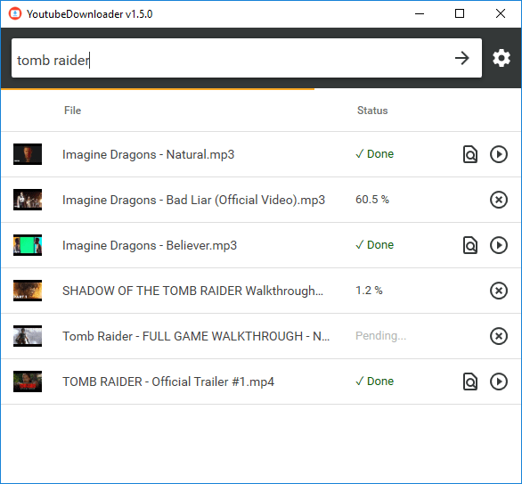
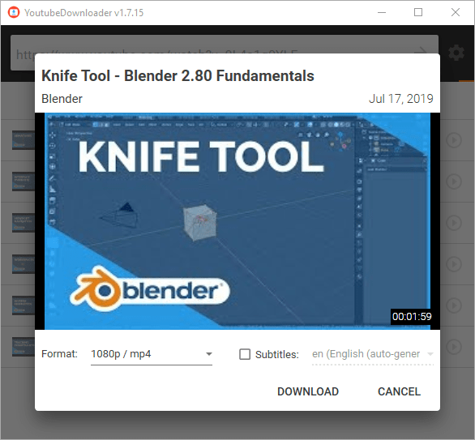
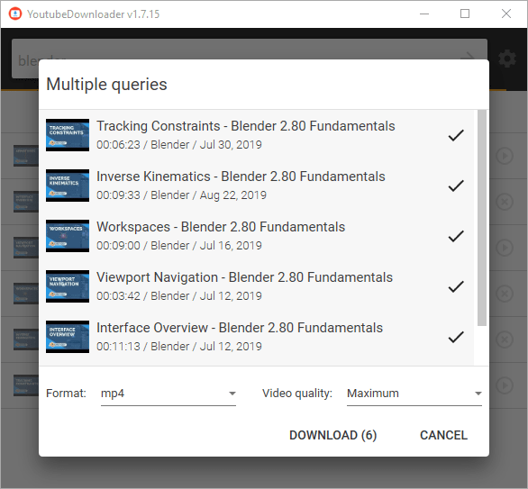

# YoutubeDownloader

thankfully forked from https://github.com/Tyrrrz/YoutubeDownloader  
This version has the ability to additionally set a default download directory in settings

YoutubeDownloader is an application that lets you download videos from YouTube. You can just copy-paste URLs of any videos, playlists or channels and download them directly to a format of your choice. It also supports searching by keywords, which is helpful if you want to quickly look up and download videos.

This application uses the [YoutubeExplode](https://github.com/Tyrrrz/YoutubeExplode) library under the hood to interact with YouTube.

## Download

- **[Latest release](https://github.com/abyssox/YoutubeDownloader/releases/latest)**
- [CI build](https://github.com/abyssox/YoutubeDownloader/actions)

Note: This application requires .NET Core runtime for desktop apps, which you can [download here](https://dotnet.microsoft.com/download/dotnet-core/current/runtime).

## Features

- Supports single videos, playlists, channels, and search queries
- Variety of output formats: mp4, webm, mp3, ogg
- Selectable video quality
- Multiple downloads in parallel with progress reporting and cancellation
- Automatic media tagging for audio downloads
- Set default download directory

## Screenshots

